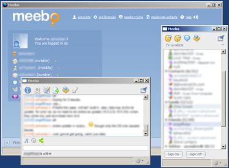

I know I&apos;m not the first person to note <a href="http://www.meebo.com/" test="true">Meebo</a>, and I know a lot of people are aware of <a href="http://labs.mozilla.com/2007/10/prism/" test="true">Prism </a>(formerly WebRunner) from Mozilla.&#xA0; The combination just happens to work very well, if only there were an option to group the window notifications to a single system tray icon.&#xA0; As having the main meebo window minimized, with the list popped out, and discussions popped out, leads to a few entrys in the taskbar. [more]

That&apos;s honestly about my only complaint here.&#xA0; I&apos;ve been using <a href="http://pidgin.im/" test="true">Pidgin</a> (formerly Gaim) quite a bit, but find the macport for it isn&apos;t working, though I haven&apos;t tried fink yet.&#xA0; it&apos;s just another option for those of us looking to take our stuff with us, and using more than one platform.

.
