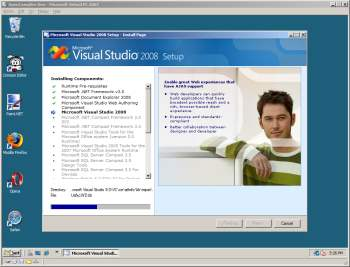

Okay, as of today I&apos;ll be spending about two days a week dedicated to <a href="http://www.opencampfire.net/" test="true">OpenCampfire.Net</a>, which in and of itself is pretty cool.&#xA0; Well, my first task is to setup my development environment.&#xA0; I&apos;ve decided to use Microsoft&apos;s Virtual PC 2007 as my host environment, since most of my development time will be done in a windows host, and a windows client.&#xA0; As you can see from my <a href="http://code.google.com/p/open-campfire/wiki/DevelopmentEnvironmentSetup" test="true">setup list</a> so far, there&apos;s a lot to do.&#xA0; I started off around 9am, and it&apos;s now 3:30 in the afternoon, and I am just finishing off my Visual Studio 2008 install. [more]

I know that everyone uses different tools depending on a given project, and different applications save there settings in different places, but it just isn&apos;t fun babysitting an install all day.&#xA0; Of course one nice thing, is once you have your baseline applications setup, you can simply copy your virtual drive, and use this as a baseline in the future.&#xA0; I&apos;ve been using my win2003 + vs2005 baseline for a couple years now, and it&apos;s worked well.&#xA0; This is using win2008 with vs2008 though, and is going to be geared towards more modern development tasks.&#xA0;&#xA0;

It would be nice if you MS had a way to &quot;unlicense&quot; your software, including windows in these VMs and allow for redistribution.&#xA0; Though given that some of the software I am installing is under various different licenses this may never actually be practical, it&apos;s just a pipe dream I guess.

&#xA0;
