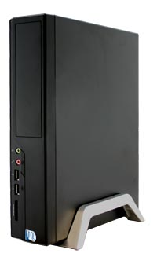

I just got my <a href="http://www.msicomputer.com/product/p_spec.asp?model=Wind_PC&amp;class=npc" test="true">MSI Wind Barebones</a> desktop unit a few days ago.&#xA0; I had been looking at some of the net-media players around, and honestly it seems like most of them have some sketchy reviews.&#xA0; When I saw this unit at <a href="http://www.newegg.com/Product/Product.aspx?Item=N82E16856167032" test="true">Newegg</a>, I had to order one.&#xA0; I&apos;d been looking at Atom based Mini-ITX boards, and cases, and this barebones came in under what the board and case of similar style would have been.&#xA0; I didn&apos;t get a Mini PCIe wireless board for it, I wasn&apos;t aware it had such a slot until after I recieved the unit. [more]

Well, I&apos;ve loaded my trusty <a href="http://www.ubuntu.com/" test="true">Ubuntu 8.04</a>, and <a href="http://xbmc.org/" test="true">XBMC Media Center</a> on the thing, and really like it a lot.&#xA0; I am able to play most of my videos without issue.&#xA0; Though most of my complaints would be centered around XBMC, given that the Linux port is fairly new, and actively worked on, I can give some slack.&#xA0; I am able to play most 720p video I have without issue on it.&#xA0; I&apos;m using 720x400 for the screen resolution on my desktop monitor.&#xA0; I&apos;ll buy a VGA to RGB adapter cable in a few weeks.

For general business use, email, and web browsing it is absolutely the best value out there bar none.&#xA0; It&apos;s also quite small and sips power.&#xA0; I&apos;m looking forward to seeing some of the prebuilt options coming from various vendors in the following months.&#xA0; I had an 80gb SATA drive, so all I needed was the ram (2GB G-Skill), and the DVD drive.. got a burner, because the SATA DVD readers weren&apos;t that far off in pricing.&#xA0; My total with shipping was under $225.

I did have to install a <a href="http://www.jamesonwilliams.com/hardy-r8168.html" test="true">driver for the Realtek 8111C network adapter in Ubuntu Hardy</a> though, I found a script that made this relatively painless though.

In the next couple weeks I may try out Windows XP and XBMC Windows, as well as an OSx86 Hackintosh install, just to see how well it works out.&#xA0; I&apos;ll probably stick with Linux, for the lower overhead in the long run, but will definitely have some fun with this thing.&#xA0;&#xA0; If you have any Media Center / Media Player applications you can recommend I try, let me know.&#xA0; I&apos;m also interested in running some classic emulators on it as well Mame, NES, Sega, etc...

&#xA0;

&#xA0;