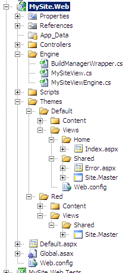

Okay, I lied.&#xA0; I really wanted to figure out how to get theming to work the way I wanted.  As you can see to the right, I created a &quot;Theme&quot; folder, where I have a &quot;Default&quot; and in this case a &quot;Red&quot; theme.&#xA0; Under the theme&apos;s folder, I moved the Content, and Views folders.&#xA0; My goal was to allow for a fallback to using a View from the Default theme, but still allow for the appropriate masterpage to be applied from the theme&apos;s folder if one existed.&#xA0; In this case, you can see that there is an Index view for the Home controller within the Default theme, but there is no matching view in the Red theme. [more]

I started off with the view engine from <a href="http://pietschsoft.com/post.aspx?id=5a6945d0-933a-4971-aac1-13dcd73711d9" test="true">Chris Pietschmann&apos;s post</a> on the issue of theming.&#xA0; The two things that weren&apos;t addressed in his post were how to account for falling back to Default (though there is a search pattern), and more importantly, how to apply the correct masterpage to a number of views within the default fallback. [more]

The first part was easy enough, I simply added a &quot;Default&quot; search to his existing methods.&#xA0; The second part is where things got tricky.&#xA0; Thankfully the <a href="http://www.codeplex.com/aspnet" test="true">ASP.Net MVC Framework&apos;s source code</a> is available for study, which was really helpful in inheriting enough functionality from the WebFormViewEngine and WebFormView classes to make this theming work the way I wanted it to.

What I did was to add an override for the CreateView method on the view engine class that used my own view class, which inherited from the WebFormView.&#xA0; In order to make the view work, I lifted a few internal classes (namely the BuildManager) from the MVC project.&#xA0; I found that the name of the MasterPageFile within the page class wasn&apos;t available until fairly low in the event chain.

<pre class="brush: csharp">override public void Render(ViewContext viewContext, TextWriter writer)
{
    if (viewContext == null)
    {
        throw new ArgumentNullException(&quot;viewContext&quot;);
    }

    object viewInstance = BuildManager.CreateInstanceFromVirtualPath(ViewPath, typeof(object));
    if (viewInstance != null)
    {
        ViewPage viewPage = viewInstance as ViewPage;
        if (viewPage != null)
        {
            RenderViewPage(viewContext, viewPage);
            return;
        }
    }

    base.Render(viewContext, writer);
}</pre>

As you can see, within the MySiteView class I had to override the Render method for the view I follow the same logic as within the WebFormView class&apos; Render method up to the point where the RenderViewPage method is called, which is where the real magic happens.

<pre class="brush: csharp">private void RenderViewPage(ViewContext context, ViewPage page)
{
    if (!String.IsNullOrEmpty(MasterPath)) {
        page.MasterLocation = MasterPath;
    } else {
        if (HttpContext.Current.Items[&quot;themeName&quot;].ToString() != &quot;Default&quot; &amp;&amp; page.TemplateSourceDirectory.Contains(&quot;/Themes/Default/&quot;))
            page.PreInit += new EventHandler(delegate(object sender, EventArgs e){
                //test for Default theme path, and replace with current theme
                string defaultthemepath = string.Format(&quot;{0}Themes/Default/&quot;, page.Request.ApplicationPath);
                if (!string.IsNullOrEmpty(page.MasterPageFile) &amp;&amp; page.MasterPageFile.ToLower().StartsWith(defaultthemepath.ToLower()))
                {
                    string newMaster = string.Format(
                        &quot;~/Themes/{0}/{1}&quot;,
                        HttpContext.Current.Items[&quot;themeName&quot;],
                        page.MasterPageFile.Substring(defaultthemepath.Length)
                    );
                    if (File.Exists(page.Server.MapPath(newMaster)))
                        page.MasterLocation = newMaster;
                }
            });
    }

    page.ViewData = context.ViewData;
    page.RenderView(context);
}</pre>

If there wasn&apos;t a match for a MasterPage, the user isn&apos;t using the Default engine and the view came from the Default theme, I inject an anonymous delegate into the page&apos;s PreInit event since the value for the MasterPageFile isn&apos;t available until this point.&#xA0; What I do then, is check and see if there is a corresponding MasterPage within the current theme, and use that instead.&#xA0; This makes the whole thing work as I would expect.

One other point of code was to make the theme settable, and changable from a number of places.&#xA0; What I did to support this was create an Application_BeginRequest method within the project&apos;s Global.asax.cs file.&#xA0; You can see how this works below.

<pre class="brush: csharp">protected void Application_BeginRequest(Object Sender, EventArgs e)
{
    SetTheme();
}

private void SetTheme()
{
    //set the theme for the ViewEngine to utilize.
    HttpContext context = HttpContext.Current;
    if (context.Items.Contains(&quot;theme&quot;)) context.Items.Remove(&quot;theme&quot;);
    context.Items.Add(
        &quot;themeName&quot;,
        CheckTheme(context.Request.QueryString[&quot;theme&quot;])
            ?? CheckTheme(context.Request.Form[&quot;theme&quot;])
            ?? CheckTheme(context.Request.Headers[&quot;theme&quot;])
            ?? CheckTheme((context.Request.Cookies[&quot;theme&quot;] == null) ? &quot;&quot; : context.Request.Cookies[&quot;theme&quot;].Value)
            ?? CheckTheme((context.Session == null) ? &quot;&quot; : context.Session[&quot;theme&quot;] as string)
            ?? CheckTheme(ConfigurationSettings.AppSettings[&quot;theme&quot;])
            ?? &quot;Default&quot;
   );
}

private string CheckTheme(string themeName)
{
    if (!string.IsNullOrEmpty(themeName))
    {
        var path = HttpContext.Current.Server.MapPath(string.Format(
            &quot;~/Themes/{0}&quot;,
            themeName
        ));
        if (Directory.Exists(path))
            return themeName;
    }
    return null;
}

private string CheckTheme(HttpCookie cookie) {
    if (cookie != null)
        return CheckTheme(cookie.Value);
    return null;
}</pre>

With the functionality changes I&apos;ve made, I can now move forward with some refactoring, and segmentation of logic.&#xA0; I haven&apos;t created any tests for this either, as it was essentially an experiment on getting the theming to work the way I wanted it to.&#xA0; It&apos;s nice that the ASP.Net MVC framework from Microsoft allows for the level of modification that it does.&#xA0; It would be nice to see similar functionality baked in though.&#xA0; I&apos;m including my solution&apos;s source code, as it is right now below.

&#xA0;

<a rel="enclosure" href="./files/MySite.zip" test="true">MySite.zip (181.33 kb)</a>
