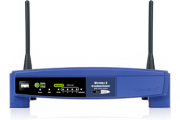
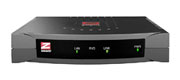

  Okay, so I&apos;ve been stuck with tethering to my G1 as my main source of internet for about two months now.&#xA0; It wasn&apos;t as bad as dialup, just the same, I am glad to have DSL setup in my apartment now.&#xA0; I&apos;m pretty much stuck with Qwest for my DSL service, being in Arizona, there are other carriers, but since Qwest owns the line to the CO/ATM network, it winds up being more for a personal connection if you use another ISP.&#xA0; So, I made the best of it.&#xA0; I&apos;m pretty fond of being able to use 3rd party firmware, and am loyal to <a href="http://www.polarcloud.com/tomato" test="true">Tomato firmware</a> on the WRT54GL currently.&#xA0; I&apos;ve considered RouterBoard as another option as well, but the WRT is just a simpler setup for personal, and even SOHO use.

After a little bit of research on the use of PPPoE over the DSL&apos;s ATM connection, I came to find that there are differences between PPPoA, PPPoE and PPPoEoA.&#xA0; PPPoA makes the authenticated connection directly over the ATM channel, this provides slightly better throughput over PPPoE, which has a lower MTU.&#xA0; PPPoEoA allows for a separate router to make a PPPoE connection over an ADSL bridge modem&apos;s Ethernet to ATM.&#xA0; If this all sounds confusing, it is.&#xA0; [more]What it comes down to, is that Qwest supports a PPPoE connection over it&apos;s ATM DSL lines in most areas, including my apartment.&#xA0; Your milage may vary here.

What this allowed me to do was use a Zoom 5615 ADSL Bridge Modem for the DSL connection.&#xA0; What you first need to do is connect via Cat5 Ethernet to the model which runs on 10.0.0.2, where you can use a 255.255.255.240 bitmask, and use 10.0.0.4 for example as your local IP, no gateway or DNS entries are needed, as you will connect directly.&#xA0; The modem&apos;s quick start guide gives you this information, as well as the default username (admin) and password (zoomadsl), I wasn&apos;t able to change the password, but it&apos;s not a big deal as that address block won&apos;t even be accessible without direct hardware access.&#xA0; The modem needs to be set to a VPI of 0 and a VCI of 32 which is available in the basic settings.&#xA0; Once this is set/saved and saved to NVRAM you should be able to check the status page, and see that your ATM connection for the modem is indeed up.&#xA0; From here you will enter your DSL username and password for a PPPoE connection on your router, connected to the modem directly.

A friend of mine runs <a href="http://angelfireaz.net/" test="true">a small ISP service in the Prescott area</a>, his host feed is via DSL and he is wanting to use MLPPP via his carrier which runs of Qwest controlled lines.&#xA0; The two lines are already setup, and in a few weeks we&apos;re going to use two of these Zoom modems, with a WRT54GL runing <a href="http://fixppp.org/" test="true">Tomato/MLPPP</a> firmware and see how that goes.&#xA0;&#xA0; If it works, it will give about 1.5MB up and about 15MB down.&#xA0; The up is actually the main barrier, also being able to configure for multi-ip routing.

I will have an update on this early next month.&#xA0; For the curious the WRT54GL is readily available through numerous sources, as is the Zoom 5615 ADSL Bridge Modem.&#xA0; I tend to favor Amazon and Newegg, and will usually go with either based on price mainly.&#xA0; It&apos;s really worth checking both for every item you purchase.&#xA0; I tend to only purchase from Amazon where Prime shipping is available, since third party vendors from Amazon have mixed results. I&apos;ve provided the links below for your conventience.

<ul>
<li><a href="http://www.newegg.com/Product/Product.aspx?Item=N82E16833124190&amp;Tpk=wrt54gl" test="true">WRT54GL on Newegg.com</a></li>
<li><a href="http://www.amazon.com/Linksys-Cisco-WRT54GL-Wireless-G-Broadband-Compatible/dp/B000BTL0OA/" test="true">WRT54GL on Amazon.com</a></li>
<li><a href="http://www.newegg.com/Product/Product.aspx?Item=N82E16825115027" test="true">Zoom 5615 on Newegg.com</a></li>
<li><a href="http://www.amazon.com/Zoom-ADSL-Bridge-Modem-5615/dp/B001TGRCFA/" test="true">Zoom 5615 on Amazon.com</a></li>
</ul>