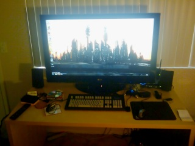

Okay, it&apos;s a TV, but I&apos;m only using it as a montitor.&#xA0; It&apos;s currently connected to my computer via DVI-to-HDMI and works pretty well.&#xA0; I&apos;d been thinking about doing this since the 32&quot; LCD TV&apos;s with 1080p started getting pretty reasonable in price.&#xA0; It doesn&apos;t have the super resolutions of some computer monitors, but 1920x1080 is enough for me to work with, and this way the image is larger, instead of most things just being rendered wrong, or stupidly small, at least for now.&#xA0; I went with a 42&quot; LG (Model 42LH50) display.

For comparison&apos;s sake, that is a Unicomp Customizer 104 keyboard (IBM Model M Style).&#xA0; The thing is freakishly huge, and I love it. 
