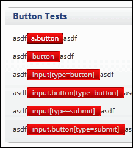

Okay, I&apos;ve been working on creating a CSS3 friendly version of the site where I am currently working.  I&apos;ve been using the very cool <a href="http://css3pie.com/" test="true">CSS3 PIE</a>(Progressive IE) to bring a lot of functionality to the interface for IE.  It works natively in Firefox 3.x, Chrome, and Safari.  There is no support for background gradients in Opera 10, but the fallback doesn&apos;t look too bad for &lt; 2% of users that have it.  IE 6-8 have been tricky, but I&apos;ve managed to get a lot of it the way I want, with minimal JavaScript for interaction (only enough to make some UI elements bind consistently).  IE9 was just released in beta today, and I was glad to see it, and it&apos;s improved rendering enhancements.

Then I come to find out that IE9 ate my PIE.  PIE simply didn&apos;t work for the background gradients or rounded corners in IE9.  So I pushed all the behavior declarations into an <code><strong>IE lt 9</strong></code> conditional comment.  I also added another stylesheet for IE9.  From here, I proceeded to add the necessary <code><strong>DXImageTransform.Microsoft.gradient</strong></code> references for IE9, which doesn&apos;t support the <code><strong>background: linear-gradient(...)</strong></code> css directive.  You can see the results to the left, the DX transformation clobbers the rounded corners.

<b>EDIT: 2011-01-10</b>

With IE9, you can do an inset box-shadow to accomplish a similar effect, without failing to work with the borders.  The effect is better on buttons, and supported almost everywhere, including Opera 10.5+ ... for IE6-8 you can fall back to the linear-gradient with PIE.  Also, the latest CSS3PIE disables itself for IE9, until that feature set can be flushed out.

<b>EDIT: 2011-09-26</b>

With IE9, you can do an inline SVG background in the CSS, Microsoft even created an <a href="http://ie.microsoft.com/testdrive/graphics/svggradientbackgroundmaker/default.html" test="true">SVG Gradient Background Maker</a>.  It is worth noting that all the browsers (that I know of) which support CSS3 background gradients also support an SVG in the CSS directly.  If you use the generation tool, you should wrap the url text in a single-quote. In other words <code>url(&apos;...&apos;)</code> not <code>url(...)</code> as the tool generates.  Many CSS minifiers will have issues if the url text isn&apos;t quoted.

 
