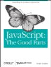
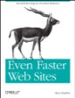
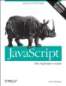
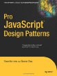

	

		I often get asked what books I recommend for developers looking to get 
		more into JavaScript.  Often they&apos;re looking for something specific to a 
		given framework, most often jQuery.  Although there are some great jQuery 
		and a couple of jQueryUI books as well, I&apos;d recommend the following books 
		first and formost for those with some knowledge of JavaScript, but wanting
		to get a better grasp.
	

	

		The first half of this year I read through eight recently published 
		books centered around JavaScript and these are the one&apos;s I would 
		recommend.  
	

	

		

		<a href="http://www.amazon.com/gp/product/0596517742?ie=UTF8&amp;tag=frugcode-20&amp;linkCode=as2&amp;camp=1789&amp;creative=9325&amp;creativeASIN=0596517742" test="true">JavaScript: The Good Parts</a> 
		is one of two JavaScript books that I feel should be required reading for all 
		web developers.  Even if you&apos;ve jumped into JS and don&apos;t care to start 
		with entry level re-hashes, this is a great read.  I don&apos;t agree 100% 
		with <a href="http://javascript.crockford.com/" test="true">Douglas Crockford</a>&apos;s 
		views.  However, this is a great read that will give some insightful 
		concepts and ideas.  Also worth looking at is 
		<a href="http://www.yuiblog.com/crockford/" test="true">Crockford&apos;s video series on YUI Blog</a>.
		 
	

	

		

		<a href="http://www.amazon.com/gp/product/0596522304?ie=UTF8&amp;tag=frugcode-20&amp;linkCode=as2&amp;camp=1789&amp;creative=9325&amp;creativeASIN=0596522304" test="true">Even Faster Web Sites: Performance Best Practices for Web Developers</a> 
		is the other book I feel should be required reading for all web developers, 
		and even designers.  It covers a lot of great examples of how JavaScript 
		and other elemental decisions in the design and markup of a site impact 
		performance.  There isn&apos;t as much specific to JS as 
		<a href="http://www.amazon.com/gp/product/059680279X?ie=UTF8&amp;tag=frugcode-20&amp;linkCode=as2&amp;camp=1789&amp;creative=9325&amp;creativeASIN=059680279X" test="true">High Performance JavaScript (Build Faster Web Application Interfaces)</a>, 
		which is another good read. There&apos;s about a 50% overlap between the two 
		books, and I feel that the former is a much more important read and 
		reading both will get very redundant, very quickly. [more]
	

	

		 Along with the books above, I would also suggest taking a look at the following books as well...
 
	

	

		

		<a href="http://www.amazon.com/gp/product/0596101996?ie=UTF8&amp;tag=frugcode-20&amp;linkCode=as2&amp;camp=1789&amp;creative=9325&amp;creativeASIN=0596101996" test="true">JavaScript: The Definitive Guide</a> 
		is a book that every beginning web developer should have on their bookshelf.  If you 
		want a more novice friendly text, I would suggest the 
		<a href="http://www.amazon.com/gp/product/0470526912?ie=UTF8&amp;tag=frugcode-20&amp;linkCode=as2&amp;camp=1789&amp;creative=9325&amp;creativeASIN=0470526912" test="true">JavaScript Bible</a>
		(<em>I&apos;m linking to the 2010 version, which should be out in October.</em>).  
		The definitive guide is a bit better as a reference text, the bible is 
		better as a learning text.
		 
	

	

		

		<a href="http://www.amazon.com/gp/product/159059908X?ie=UTF8&amp;tag=frugcode-20&amp;linkCode=as2&amp;camp=1789&amp;creative=9325&amp;creativeASIN=159059908X" test="true">Pro JavaScript Design Patterns</a> is another book worth looking at.
		Though I honestly feel that there will usually be simpler solutions to 
		most given problems, reading this book provides a gateway to several good 
		thought experiments and can provide some insightful ideas on how to 
		resolve some common issues with design patterns.
		 
	

	

		If you&apos;re first starting out, I would go through The 
		Definitive Guide, before looking into The Good Parts, or Even Faster 
		Web Sites.  Beyond this, there are a lot of blogs out there covering 
		JavaScript from many different vantage points, and lots of frameworks 
		and tools out there.  I feel that these books are a great starting 
		point to understanding JavaScript better and a greater understanding of 
		how JavaScript works, instead of blindly cutting and pasting framework 
		examples.
	

