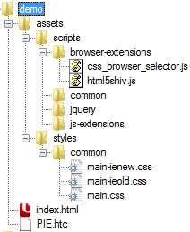
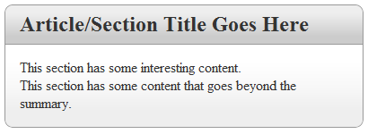

This is Part 2 in a series on creating a web application utilizing modern  techniques in order to deliver a fast, cohesive site.  The index for this series  can be found at the end of <a href="http://frugalcoder.us/post/2010/10/25/modern-web-apps-part001.aspx" test="true">part 1 in this series</a>.

<a href="http://demo.frugalcoder.us/modern-web-app/part-002/demo/index.html" test="true">View the Part2 demo page.</a>   <a href="http://demo.frugalcoder.us/modern-web-app/part-002/part2-demo.zip" test="true">Download the Part2 demo.</a>

As you can see on the left, we are starting out with a fairly simple  file structure.  In order to keep things simple, we are going to assume  that this is going to be run from the root of the website.

The first thing I&apos;d like to do is point out the PIE.htc file in the  root directory.  This comes from the <a href="http://css3pie.com/" test="true">CSS3PIE</a> project and will be used to aid IE6-8 in rendering CSS3 features such as  rounded borders and background gradients.  There isn&apos;t full support for  every feature of CSS3, and there are a couple of quirks.  However, this is  still a far better use of resources to work around these minor IEOLD issues  rather than having the additional images and markup needed to do  rounded corners and background gradients via other, more traditional  methods.

Second, I&apos;d like to point out that I&apos;m starting off with two JavaScript files in place.  First is the wonderful  <a href="http://code.google.com/p/html5shiv/" test="true">html5shiv</a> which adds support for  HTML5 tags in IE6-8.  The second is <a href="http://github.com/rafaelp/css_browser_selector" test="true">css_browser_selector.js</a>, which adds specific classes to the HTML (documentElement) element in order to write  clean CSS rules when possible. This functionality is only useful when JavaScript  is enabled, so it should be used sparingly.  As IE is still the browser king, with several quirky variations  on rendering, we&apos;ll also be adding in some conditional elements in order to target  specific IE versions in our CSS.  The other JavaScript file in the head

At this point I am going to point out that I&apos;ve defined three stylesheets.  I&apos;ve  created a general main.css as well as the addition of a main-ienew.css and  main-ieold.css.  Where the ienew variant will be fore IE9+ and the ieold will target IE6-8 specifically.  The main reason for this is because of some current  quirkiness in IE9 beta where it will load PIE.htc behavior on elements despite  being set not do to so.

<pre class="brush: css">example: #ieold .className { behavior: url(/PIE.htc); }</pre>

At this point, I&apos;m going to point out the actual markup of our starting page, then  go over the CSS that will be in place to support this.  This is a demonstration  of creating the rounded corners and background gradients only.  Other operations  will be covered in future articles.

<pre class="brush: html">&lt;!DOCTYPE html&gt;
&lt;html&gt;
&lt;head&gt;
  &lt;!-- Meta Data --&gt;
  &lt;meta http-equiv=&quot;X-UA-Compatible&quot; content=&quot;IE=99,chrome=1&quot; /&gt;
  &lt;meta name=&quot;description&quot; content=&quot;&quot; /&gt;
  &lt;meta name=&quot;keywords&quot; content=&quot;&quot; /&gt;
  &lt;link rel=&quot;shortcut icon&quot; type=&quot;image/ico&quot; href=&quot;/favicon.ico&quot; /&gt;

  &lt;title&gt;Part 2 - Creating A Modern Web Application&lt;/title&gt;

  &lt;!-- Inject browser classes, and add support for HTML5 tags to IEOLD --&gt;
  &lt;script src=&quot;assets/scripts/browser-extensions/html5shiv.js&quot;&gt;&lt;/script&gt;
  &lt;script src=&quot;assets/scripts/browser-extensions/css_browser_selector.js&quot;&gt;&lt;/script&gt;

  &lt;!-- core css markup --&gt;
  &lt;link rel=&quot;stylesheet&quot; type=&quot;text/css&quot; href=&quot;assets/styles/common/main.css&quot; /&gt;
  &lt;!--[if gte IE 9]&gt;&lt;link rel=&quot;stylesheet&quot; type=&quot;text/css&quot; href=&quot;assets/styles/common/main-ienew.css&quot; /&gt;&lt;![endif]--&gt;
  &lt;!--[if lt IE 9]&gt;&lt;link rel=&quot;stylesheet&quot; type=&quot;text/css&quot; href=&quot;assets/styles/common/main-ieold.css&quot; /&gt;&lt;![endif]--&gt;

  &lt;!-- print css markup --&gt;
  &lt;link rel=&quot;stylesheet&quot; type=&quot;text/css&quot; media=&quot;print&quot; href=&quot;assets/styles/common/main-print.css&quot; /&gt;  
&lt;/head&gt;</pre>

Above you see the content through the HEAD section of the document.  We first start with the HTML5 DOCTYPE, which in essense tells the browser to  use whatever the newest/current rendering engine available has to offer.   Next we include some meta elements, the first of which <code>X-UA-Compatible</code>. As of Internet Explorer version 8, the rendering engine for 7 and 8 are included,  unfortunately IE6 is not.  I suggest using IE Tester, or a stand-alone installer  for older IE version testing.  The X-UA-Compatible meta attribute can set the  IE renderer to be used and is set to 99 in our example to future-proof things.  If you come across issues with IE9 or later, this can be helpful to force the  older rendering until specific issues can be worked out.  You will also notice  the <code>chrome=1</code> portion; which will tell IE browsers with the Chrome  Frame plugin installed to utilize the Chrome rendering engine where available.  I personally consider the Webkit rendering engine along with the V8 JavaScript  engine the gold standard to view against.  This may change in the future, but  for now, how it renders in Webkit (Chrome/Safari) should be considered how it  *should* be rendering.  This will give you the least resistance in adjusting  for non-compliant browsers.

After the typical meta elements for keywords, description and a link to the favicon.  The regular TITLE element is encluded.  It&apos;s worth noting that within the TITLE element,  you should have your specific section of the site first, followed by more generic  information.  In this case, I&apos;m starting with the specific page&apos;s name, followed  by the title of the site/series.  This can help will SEO, as having the same  content in every title dilutes the value of that title across a site.

The first scripts we include are those that *must* be included in the head in  order to function properly, and before any stylesheets are loaded.  This will  reduce the impact of said scripts on the css that comes next.  After the main.css, I am including some conditional scripts for IENEW and IEOLD, where IEOLD is  anything prior to version 9 (our support target is 6-9), and IENEW is defined  as anything from version 9 on (which supports HTML5).  After the general  stylesheets we&apos;re including a css to establish print adjustments.  It&apos;s  important to establish a print media stylesheet that reduces the additional clutter  such as the header, footer and page margins in order for the printing experience  to be better.

On to the rest of the html file...

<pre class="brush: html">&lt;body&gt;
&lt;!--[if IE 6]&gt;&lt;div id=&quot;ie6&quot; class=&quot;ie&quot;&gt;&lt;![endif]--&gt;
&lt;!--[if IE 7]&gt;&lt;div id=&quot;ie7&quot; class=&quot;ie&quot;&gt;&lt;![endif]--&gt;
&lt;!--[if IE 8]&gt;&lt;div id=&quot;ie8&quot; class=&quot;ie&quot;&gt;&lt;![endif]--&gt;
&lt;!--[if IE 9]&gt;&lt;div id=&quot;ie9&quot; class=&quot;ie&quot;&gt;&lt;![endif]--&gt;
&lt;!--[if lt IE 9]&gt;&lt;div id=&quot;ieold&quot;&gt;&lt;![endif]--&gt;
&lt;!--[if gte IE 9]&gt;&lt;div id=&quot;ienew&quot;&gt;&lt;![endif]--&gt;
&lt;![if !IE]&gt;&lt;div id=&quot;noie&quot;&gt;&lt;![endif]&gt;

  &lt;article class=&quot;grid_4&quot;&gt;
    &lt;hgroup&gt;
      &lt;h2&gt;Article/Section Title Goes Here&lt;/h2&gt;
    &lt;/hgroup&gt;
    &lt;details&gt;
      &lt;summary&gt;This section has some interesting content.&lt;/summary&gt;
      &lt;div&gt;
        This section has some content that goes beyond the summary.
      &lt;/div&gt;
    &lt;/details&gt;
  &lt;/article&gt;

&lt;!--[if IE 6]&gt;&lt;/div&gt;&lt;![endif]--&gt;
&lt;!--[if IE 7]&gt;&lt;/div&gt;&lt;![endif]--&gt;
&lt;!--[if IE 8]&gt;&lt;/div&gt;&lt;![endif]--&gt;
&lt;!--[if IE 9]&gt;&lt;/div&gt;&lt;![endif]--&gt;
&lt;!--[if lt IE 9]&gt;&lt;/div&gt;&lt;![endif]--&gt;
&lt;!--[if gte IE 9]&gt;&lt;/div&gt;&lt;![endif]--&gt;
&lt;![if !IE]&gt;&lt;/div&gt;&lt;![endif]&gt;
&lt;/body&gt;
&lt;/html&gt;</pre>

Within the BODY element, the first thing added is a number of DIV elements  surrounded by IE&apos;s conditional comments.  These comments allow for the CSS to  target a specific version of IE, or even a non IE browser without the need for  JavaScript (as added by the css_browser_selector.js), which can improve the  initial rendering.  It should be noted that we won&apos;t be avoiding JavaScript  and progressive enhancement, but one should be mindful of the rendering of a  page without JavaScript as this can help with visually impaired users as well  as the initial load impression of a given page/site.

Within the browser elements, we see some very semantic markup.  An ARTICLE element  is a container, which has an HGROUP (Header Group) element followed by a DETAILS  element.  The DETAILS element&apos;s first child is a SUMMARY element which contains the  relative information regarding the rest of the DETAILS section.  This can be thought  of as similar to the relationship of a LEGEND element inside of a FIELDSET.  Though  the SUMMARY element is meant to be used as an inline element, we&apos;ll be displaying  it as a block element.  These tags may seem very blog oriented, and in a way  they are.  However, they do make for some very natural containers, as well as  being far shorter than adding class names to meaningless nested div tags.  There  is also a SECTION element that&apos;s been added which can be used to contain multiple  ARTICLE tags for example.  The use of these tags at a higher level allow for very  simple CSS rules, and can minimize the risk of a conflict in structure for nested  tags from external resources or controls down the road.

Finally we get into the .css files.  I&apos;ll be stepping through the relevant  portions, though you&apos;ll be able to download the full demonstration as well as  view the demo page online.

<pre class="brush: css">h1, h2, h3, h4, h5, h6 {
  margin:0;
  border:0;
  padding:0;  
}

/*sectioning content, (todo: use css grid) */
.grid_4 {
  display:block;
  position: relative;
  width: 400px;
  z-index: 100;
}</pre>

First, I reset the margin/border/padding for Heading elements.  The next article  will have a more complete reset css attached, along with some @font-face declarations  to ensure a consistant rendering.  Next is the <code>.grid_4</code> declaration  which will be replaced with a generated grid 12 css in the next article as well.

<pre class="brush: css">/*section header, gradient with rounded top-left and top-right border*/
hgroup {
  display:block;
  color: #333333;
  padding: 0.5em 1em 0.5em 1em;
  border: 1px solid #999;
  -webkit-border-radius: 0.6em 0.6em 0 0;
  -moz-border-radius: 0.6em 0.6em 0 0;
  border-radius: 0.6em 0.6em 0 0;
  background: #dddddd;
  background: -webkit-gradient(linear,left top,left bottom,color-stop(0.2,#eeeeee),color-stop(0.8,#cccccc));
  background: -moz-linear-gradient(#eeeeee, #cccccc);
  background: linear-gradient(#eeeeee, #cccccc);
  -pie-background: linear-gradient(#eeeeee, #cccccc);
}</pre>

Here is where we start digging into the meat of this article.  Within the HGROUP  we specify the various implementations of <code>border-radius</code> as this  attribute is only recently being formalized by the W3C, webkit (Chrome &amp; Safari)  and Mozilla (Firefox) browsers created their own vender specific css attributes,  so we start with them.  They all follow the same format allowing you to specify  each corner&apos;s value in a clockwise fashion starting with the TOP-LEFT position.

After the <code>border-radius</code> is defined, the background is then specified.  How this is done is to first specify a background color that will be used as a  fallback value.  After this, we specify the vendor specific implementations and  finally fallback to a common CSS3 implementation. You can find quite a bit of information on CSS gradients in this article.  It&apos;s  worth noting that the linked article has a few things that are at least  mis-represented in regards to IE9, I&apos;ll discuss these in more  detail when we reach part 5 in this series.

For now I&apos;ll note that the -pie-background is required for the CSS3PIE  implementation for IEOLD (6-8) and that the z-index for the grid_4 is also  related to a quirk in using PIE.htc.  You can see the contents of the  <code>main-ieold.css</code> file below.

<pre class="brush: css">hgroup, details {
  behavior: url(/PIE.htc);
}</pre>

Here we have a very short, very simple statement essentially telling the browser  to apply the PIE.htc component to the HGROUP and DETAILS elements (currently  the only ones using rounded corners or background-gradients.  Next, let&apos;s take a  quick look at the main-ienew.css.

As you can see; the effect is rather nice, you can modify this example  for your specific needs.  It&apos;s definitely much lighter on resources and download  speeds by not having to rely on heavy markup and images to accomplish this effect.  However, there is one caveat with IE9 currently.

<pre class="brush: css" style="clear:left;">hgroup {
  -ms-filter: &quot;progid:DXImageTransform.Microsoft.gradient(GradientType=0,startColorstr=&apos;#eeeeee&apos;, endColorstr=&apos;#cccccc&apos;)&quot;;
}

details {
  -ms-filter: &quot;progid:DXImageTransform.Microsoft.gradient(GradientType=0,startColorstr=&apos;#ffffff&apos;, endColorstr=&apos;#eeeeee&apos;)&quot;;
}</pre>

IE9 supports the rounded corners internally, but the background gradients require  falling back to utilizing an ActiveX based filter control via the <code>-ms-filter</code> property.  We didn&apos;t add this into the main css as we wanted to avoid the potential  for IE8 to interpret this attribute. IE9 seems to have a rendering  bug where in some cases it will render the background gradient outside of the  containing border (with a border-radius) as can be seen to the left.

 
