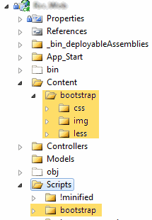

	I&apos;ve been a big fan of the <a href="http://chirpy.codeplex.com/" test="true">Chirpy</a> Add-In for Visual Studio for a couple of 
	years now.  Recently I started work on a project where it made sense to use
	<a href="http://twitter.github.com/bootstrap/" test="true">Twitter Bootstrap</a> as a base set of CSS and JavaScript within an ASP.Net MVC 3
	project.  Since I needed to adjust the colors, and a few other settings, I 
	figured it would be simple enough.  Unfortunately the main .less files use 
	<code>@import</code> directives in order to include the necessary files in 
	the correct order, which Chirpy doesn&apos;t seem to support.

	
	I came across <a href="http://www.annhoang.net/twitter-bootstrap-in-visual-studio-2010-with-chirpy-and-dotless/" test="true">another blog post</a> that mentions using dotLess in the same scenario to build the .less 
	files as a pre-build event.  I went a slightly different route.  Instead 
	of using dotLess, I went with NodeJS and lessc as the compiler, this also 
	allows me to use cssmin as a css minifier within the same build event.

	
	First, you will want to download the latest Bootstrap source files, placing
	the less and img folders within the same parent.  In this case, I used
	<code>~/Content/bootstrap/less</code> and <code>~/Content/bootstrap/img</code>
	for the less and img content.  I placed the js into <code>~/Scripts/bootstrap</code>.

	
	Second you will want to download and install the latest <a href="http://nodejs.org/" test="true">NodeJS</a> for windows. 
	After that, from a command prompt, you&apos;re going to need to use the 
	Node Package Manager (npm) to install the global utilities for <code>less</code> and 
	<code>cssmin</code> from a command prompt.

<pre class="brush: shell">npm -g install less
npm -g install cssmin</pre>

	
	Third, you&apos;ll need to setup your Post-build event. 
	Right-click the web project, then select properties.  Then bring up the &quot;Build Events&quot; tab.  
	From there, I have the following text in my &quot;Pre-build event command line&quot;

	
<pre class="brush: shell">&quot;$(ProjectDir)!PreBuild.cmd&quot; &quot;$(ProjectDir)&quot; &quot;$(DevEnvDir)&quot;</pre>
	

	With that in place, I added a &quot;!PreBuild.cmd&quot; batch file into the root of the project with the following content. 
	(note: make sure the file is saved with DOS/ASCII encoding mode text, not UTF.  Create it in Notepad if need be)

	
<pre class="brush: shell">@echo off
cls

echo.
echo !PreBuild.cmd %1

:: Remove quotes from project path...
SET _projpath=%1
SET _projpath=###%_projpath%###
SET _projpath=%_projpath:&quot;###=%
SET _projpath=%_projpath:###&quot;=%
SET _projpath=%_projpath:###=%

:: Remove quotes from _devenv path
SET _devenv=%2
SET _devenv=###%_devenv%###
SET _devenv=%_devenv:&quot;###=%
SET _devenv=%_devenv:###&quot;=%
SET _devenv=%_devenv:###=%

:: Checkout the files to be built
&quot;%_devenv%tf&quot; checkout /lock:none &quot;%_projpath%Content\bootstrap\css\*.*&quot;

echo.
echo Build bootstrap.less
call lessc &quot;%_projpath%Content\bootstrap\less\bootstrap.less&quot; &quot;%_projpath%Content\bootstrap\css\bootstrap.css&quot;
call cssmin &quot;%_projpath%Content\bootstrap\css\bootstrap.css&quot; &gt; &quot;%_projpath%Content\bootstrap\css\bootstrap.min.css&quot;

echo.
echo Build responsive.less
call lessc &quot;%_projpath%Content\bootstrap\less\responsive.less&quot; &quot;%_projpath%Content\bootstrap\css\responsive.css&quot;
call cssmin &quot;%_projpath%Content\bootstrap\css\responsive.css&quot; &gt; &quot;%_projpath%Content\bootstrap\css\responsive.min.css&quot;
</pre>

	
	With the above pre-build batch in place, the css directory will be checked out, and the bootstrap css files will 
	be created with a minified version.

